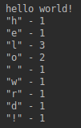

# Char Counter

## Description

- This is a char-counter Java application  that takes a string and returns the number of unique characters in the string. 

>_String must have at least one character._

## Example:

- 

## Usage

- In the root folder of this project enter command to build project:

> mvn clean package spring-boot:repackage

- To execute in the root folder of this project enter command:

> java -jar target/CharCounter.jar
